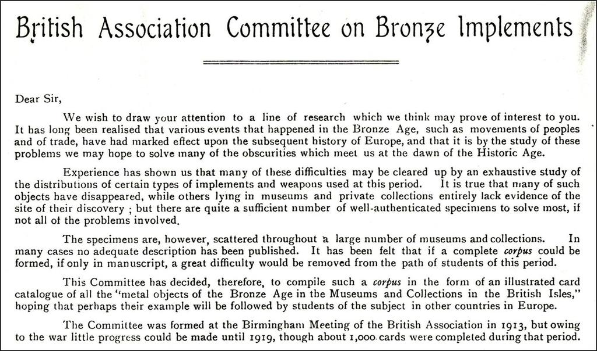
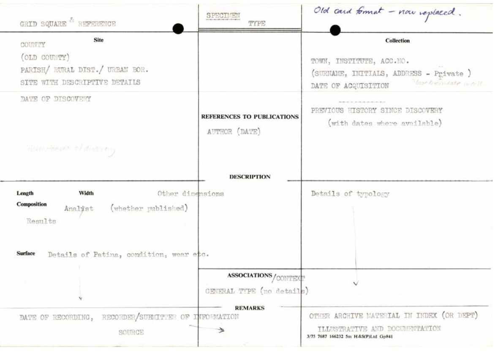
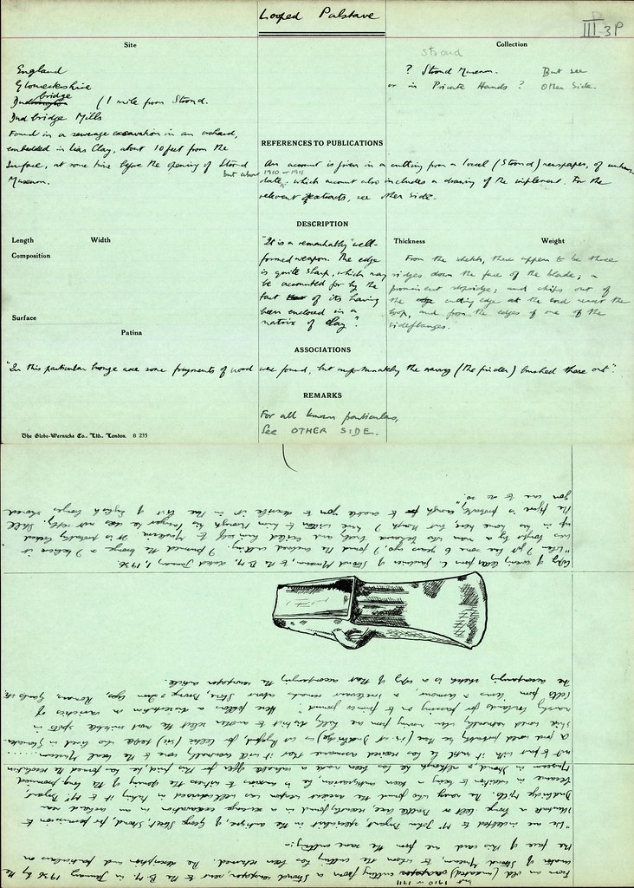
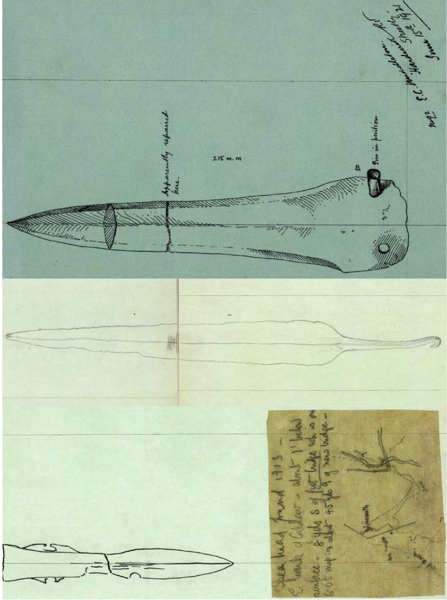

The cards and documents illustrated within this project mainly come from the National Bronze Age Index (NBAI) stored at the British Museum (BM). This cataloguing project was developed in 1913 as one of the first catalogues to document British and European prehistory on a large scale.

Known as the “principal instrument of research in the British Bronze Age”, the main concept behind the creation of the Index was the idea that by compiling a corpus of all Bronze Age metal objects found in the various museums and collections across the UK, it would be possible for the first time for researchers to study “the movements of peoples and trade through the exhaustive study of the distributions of certain types of implements and weapons used in the period”.

This corpus took the form of an illustrated card catalogue (employing 25 × 18 cm Globe-Wernicke Co. standard filing cards), with each index card detailing object find spots and types, alongside detailed line drawings and a wide range of further information about the object’s context of discovery, illustrated below. For over 80 years, it represented the highest standards of Bronze Age object studies, eventually containing around 30,000 double-sided cards, and was worked on by numerous well-known prehistorians and former BM curators, most famously Christopher Hawkes in the 1930s–1960s and Stuart Needham in the 1970s–1990s.

The amount of information contained on such cards could be extensive and intriguing. Often we see a tension exhibited in these cards between systematization (Figure 2) and free-form narrative (Figure 3), beautiful typological drawings and quick sketches (Figure 4), classification and creativity.

Beyond recording typological data, often these cards contain additional information offering fascinating insights into the circumstances of the object’s discovery. There is serendipity in the archives, as well. We have cards that record donations by Queen Victoria to the BM of a bronze axe found in Windsor Great Park in 1866.

Another card records an object discovered in 1808 at Osmington Hill, Dorset whilst cutting a hill figure dedicated to King George III, who would often pass by on his way to his seaside residence at Weymouth. In these cases, and many others, the cards’ record of historical moments or connections to significant personages seems to eclipse their primary function as a record of archaeological artefacts.

The cards also begin to act as a sort of proxy for the objects themselves, an idea of materiality. The records are descriptions of something material on a medium that is a “material” itself, but in reality it is the information itself that is the historical artefact and the main objects of study.

 Consequently, the record of the human interaction with these archives proves to be just as fascinating to study as the information actually contained in the records, as contributors to the field of history of archaeology can certainly attest to (for example, see Murray 2014).Figure 7.“X” marks the spot. Detail of a NBAI card, showing the findspot of a spearhead (© Trustees of the British Museum CC-BY).
